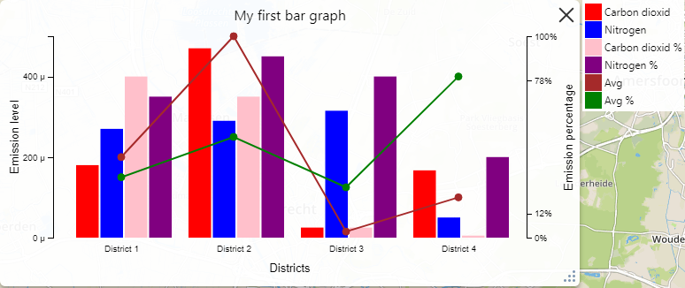

# Category graph JSON format

This is a specification of the JSON format of a category graph. Category graph is kind of graphs where `x` axis contains categories and is discrete.

The format is a specialization of the [graph](./graphJsonFormat.md) format.

#### Properties

| Property | Type | Description |
|---|---|---|
| id | string | Unique identifier of the graph. |
| apiVersion | string | Vesion of the graph format. Current version is `graph/1.0` |
| title | string | Graph title. |
| type | string | Graph type. For category graph the value is always `"category"` |
| axes | [Axes](#axes) | Describes what axes are used and what are their properties and settings. Each axis can have a flexible configuration, e.g. axis scale, ticks and units. Every data point is bind to one of the `y` axes. |
| categories | Array&lt;[Category](#category)&gt; | Describes the graph categories. These categories will be shown on `x` axes. Each data point belongs to one of the categories. Consider category as an `x` coordinate of a data point. `categories` field is only relevant for the category graphs.  |
| series | Array&lt;[Series](#series)&gt; | A list of objects to be drawn on the graph. Depending on it's type every single series can represent a single line or a set of bars. If a series represents bars then each data point of the series is a bar. All bars within a single series are semantically united and have the same color and a common entry in the legend. Any number of series with any number of data points is allowed. |

#### Axes <a name="axes"></a>

| Property | Type | Description |
|---|---|---|
| yLeft | [Axis](#axis) | `y` axis shown on the left side of the graph. Note that at least one of the `y` axes should be specified. |
| yRight | [Axis](#axis) | `y` axis shown on the right side of the graph. Note that at least one of the `y` axes should be specified. |
| xBottom | [Axis](#axis) | `x` axis shown on the bottom of the graph. This axis will display `categories`. Note that this field is limited comparing to other axes and has only one significant property `title`. Other [Axis](#axis) properties will have no affect on the `xBottom` axis. Graph `categories` will be used as a source for the ticks of the `xBottom` axis. |
| xTop | [Axis](#axis) | **Not supported**. |

**Note** that each axis property name is axis id that is referenced from within data points.

#### Axis <a name="axis"></a>

| Property | Type | Description |
|---|---|---|
| title | string | **Optional**. Axis title. |
| scale | Array&lt;number&gt; | **Optional**. Axis scale as an array of two elements where the first element is the axis start value and the second one is it's end. E.g. `[0, 100]` scale will result in a axis with values in the range between 0 and 100. If this property is not set then scale will be selected automatically depending on `y` values of the data points bind to the axis. |
| formatSpecifier |	string | Ticks and tooltips numeric values formatting. Refer [d3-format](https://github.com/d3/d3-format#locale_format). |
| units | string | **Optional**. Axis units. If set then units will be displayed on the axis and together with data point value. |
| ticks | number or Array&lt;number&gt; | **Optional**. If a number then determines how many ticks will be displayed on the axis. If an array then specifies the exact ticks that should be shown, e.g. `[0, 56, 89, 100]` will display 4 ticks on the axis: 0, 56, 89 and 100.  |

#### Category <a name="category"></a>

| Property | Type | Description |
|---|---|---|
| id | string | Category id. The category id is referred form within data points via `categoryId` property. Data point belongs to a category referred in the `categoryId` property. |
| title | string | Category title that will be displayed under space allocated for the category on the `x` axis. |

#### Series <a name="series"></a>

| Property | Type | Description |
|---|---|---|
| id | string | Series id. This id will be used to identify the series so that it can be changed individually instead of changing the whole graph. Because each series is shown as a separate item in the legend the id is used to identify the series that allows enabling or disabling a certain series. |
| type | `"bar"` or `"line"` | Currently category graph supports only two series types: bars and lines. |
| color | string | **Optional**. If defined all bars within the series or a line defined be the series will have the specified color. If not defined then color will be assigned automatically. |
| title | string | Series title. Will be displayed in the legend as well as in tooltip when bar or line is hovered. |
| data | Array&lt;[DataPoint](#dataPoint)&gt; | If series type is `"bar"` each data point defines a single bar. If series type is `"line"` then each data point defines a point on a line graph.  |

#### DataPoint <a name="dataPoint"></a>

| Property | Type | Description |
|---|---|---|
| categoryId | string | Category id. Refers to a category used as `x` coordinate for the data point. If bar data points (bars) share the same category then they will divide the space allocated for the category. |
| y | string | Bar height or line point `y` coordinate. Note that *y* can have a negative value. When represented on a graph the axis is taken into account and the *y* value is scaled correspondingly. |
| axisId | string | Axis id. Refers to an axis to which the *y* property is bind to. |

#### Examples <a name="examples"></a>

#### Series array usage examples

```json
// Single series that has single bar located in the "AmsterdamCategoryId" category.
[
    {
        "id": "AASFFGG3454XQ",
        "type": "bar",
        "title": "CO2",
        "data": [
            {
                "categoryId": "AmsterdamCategoryId",
                "y": 300,
                "axisId": "yLeft"
            }
        ]
    }
]
```

```json
// Single series that has two bars located in different categories
[
    {
        "id": "AASFFGG3454XQ",
        "type": "bar",
        "title": "CO2",
        "data": [
            {
                "categoryId": "AmsterdamCategoryId",
                "y": 300,
                "axisId": "yLeft"
            },
            {
                "categoryId": "RotterdamCategoryId",
                "y": 320,
                "axisId": "yLeft"
            }
        ]
    }
]
```

```json
// Single series that is a line graph with three points in different categories
[
    {
        "id": "AASFFGG3454XQ",
        "type": "line",
        "title": "CO2",
        "data": [
            {
                "categoryId": "AmsterdamCategoryId",
                "y": 300,
                "axisId": "yLeft"
            },
            {
                "categoryId": "RotterdamCategoryId",
                "y": 320,
                "axisId": "yLeft"
            },
            {
                "categoryId": "LeidenCategoryId",
                "y": 310,
                "axisId": "yLeft"
            }
        ]
    }
]
```

```json
// Two different series that have two bars located in different categories each
[
    {
        "id": "AASFFGG3454XQ",
        "type": "bar",
        "title": "CO2",
        "data": [
            {
                "categoryId": "AmsterdamCategoryId",
                "y": 300,
                "axisId": "yLeft"
            },
            {
                "categoryId": "RotterdamCategoryId",
                "y": 320,
                "axisId": "yLeft"
            }
        ]
    },
    {
        "id": "BASNFGGHJ52WP",
        "type": "bar",
        "title": "NO2",
        "data": [
            {
                "categoryId": "AmsterdamCategoryId",
                "y": 70,
                "axisId": "yLeft"
            },
            {
                "categoryId": "RotterdamCategoryId",
                "y": 120,
                "axisId": "yLeft"
            }
        ]
    }
]
```

#### Entire category graph example

The graph data below will result in the following representation



```json
{
    "id": "id2",
    "title": "My first bar graph",
    "type": "category",
    "axes": {
        "yLeft": {
            "title": "Emission level",
            "units": " μ",
            "ticks": 3
        },
        "yRight": {
            "title": "Emission percentage",
            "scale": [
                0,
                100
            ],
            "units": "%",
            "ticks": [
                0,
                12,
                78,
                100
            ]
        },
        "xBottom": {
            "title": "Districts"
        }
    },
    "categories": [
        {
            "id": "dist1",
            "title": "District 1"
        },
        {
            "id": "dist2",
            "title": "District 2"
        },
        {
            "id": "dist3",
            "title": "District 3"
        },
        {
            "id": "dist4",
            "title": "District 4"
        }
    ],
    "series": [
        {
            "type": "bar",
            "id": "co2",
            "color": "red",
            "title": "Carbon dioxid",
            "data": [
                {
                    "categoryId": "dist1",
                    "y": 180,
                    "axisId": "yLeft"
                },
                {
                    "categoryId": "dist2",
                    "y": 470,
                    "axisId": "yLeft"
                },
                {
                    "categoryId": "dist3",
                    "y": 25,
                    "axisId": "yLeft"
                },
                {
                    "categoryId": "dist4",
                    "y": 167,
                    "axisId": "yLeft"
                }
            ]
        },
        {
            "type": "bar",
            "id": "no2",
            "color": "blue",
            "title": "Nitrogen",
            "data": [
                {
                    "categoryId": "dist1",
                    "y": 270,
                    "axisId": "yLeft"
                },
                {
                    "categoryId": "dist2",
                    "y": 290,
                    "axisId": "yLeft"
                },
                {
                    "categoryId": "dist3",
                    "y": 315,
                    "axisId": "yLeft"
                },
                {
                    "categoryId": "dist4",
                    "y": 50,
                    "axisId": "yLeft"
                }
            ]
        },
        {
            "type": "bar",
            "id": "co2%",
            "color": "pink",
            "title": "Carbon dioxid %",
            "data": [
                {
                    "categoryId": "dist1",
                    "y": 80,
                    "axisId": "yRight"
                },
                {
                    "categoryId": "dist2",
                    "y": 70,
                    "axisId": "yRight"
                },
                {
                    "categoryId": "dist3",
                    "y": 5,
                    "axisId": "yRight"
                },
                {
                    "categoryId": "dist4",
                    "y": 1,
                    "axisId": "yRight"
                }
            ]
        },
        {
            "type": "bar",
            "id": "no2%",
            "color": "purple",
            "title": "Nitrogen %",
            "data": [
                {
                    "categoryId": "dist1",
                    "y": 70,
                    "axisId": "yRight"
                },
                {
                    "categoryId": "dist2",
                    "y": 90,
                    "axisId": "yRight"
                },
                {
                    "categoryId": "dist3",
                    "y": 80,
                    "axisId": "yRight"
                },
                {
                    "categoryId": "dist4",
                    "y": 40,
                    "axisId": "yRight"
                }
            ]
        },
        {
            "type": "line",
            "id": "avg",
            "color": "brown",
            "title": "Avg",
            "data": [
                {
                    "categoryId": "dist1",
                    "y": 200,
                    "axisId": "yLeft"
                },
                {
                    "categoryId": "dist2",
                    "y": 500,
                    "axisId": "yLeft"
                },
                {
                    "categoryId": "dist3",
                    "y": 15,
                    "axisId": "yLeft"
                },
                {
                    "categoryId": "dist4",
                    "y": 100,
                    "axisId": "yLeft"
                }
            ]
        },
        {
            "type": "line",
            "id": "avg%",
            "color": "green",
            "title": "Avg %",
            "data": [
                {
                    "categoryId": "dist1",
                    "y": 30,
                    "axisId": "yRight"
                },
                {
                    "categoryId": "dist2",
                    "y": 50,
                    "axisId": "yRight"
                },
                {
                    "categoryId": "dist3",
                    "y": 25,
                    "axisId": "yRight"
                },
                {
                    "categoryId": "dist4",
                    "y": 80,
                    "axisId": "yRight"
                }
            ]
        }
    ]
}
```
