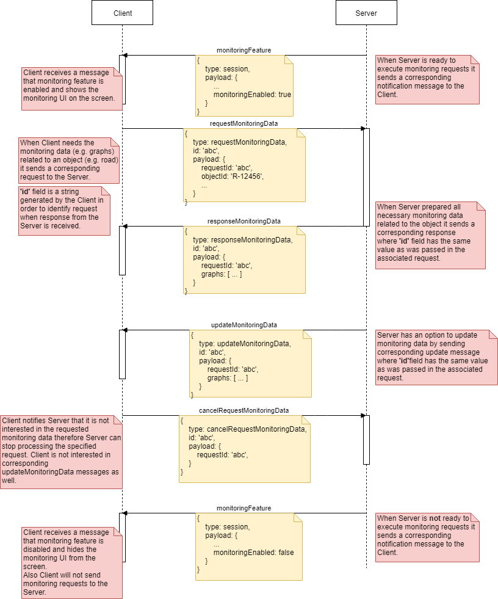

# Monitoring protocol

Protocol describes how Server (Publisher) and Client (WebClient/frontend) should communicate via a WebSocket connection to implement Monitoring feature.

Monitoring feature allows Client to get information about an object on the map (road, road link, route, etc). Generally speaking this protocol does not restrict to a certain object type and in theory it can be any object that Client want to get info about.

## Protocol

Protocol is a request-response based interaction where requests, responses and updates are JSON objects transfered via WebSocket.



| Message | Kind | Description |
|-|-|-|
| monitoringFeature | notification | Server notifies Client that it is ready to execute Monitoring requests. |
| requestMonitoringData | request | Client sends the request to Server to get monitoring data. |
| responseMonitoringData | response | Server sends the response to Client when data is ready. The response is bind to the initial requests via the `id` property. The response contains monitoring data or emty data if Server doesn't have the data. |
| updateMonitoringData | notification | Server may notify Client when the monitoring data previously requested by Client is changed. The notification is bind to the initial requests via the `id` property. |

### monitoringFeature

```
{
  "type": "monitoringFeature",
  "payload": {
    "enabled": true
  }
}
```

| Property | Type | Description |
|-|-|-|
| type | `'monitoringFeature'` | Message type. |
| payload.enabled | boolean | Indicates if the feature is enabled or disabled and if Server is ready to execute monitoring requests. `true` in case feature is enabled and `false` otherwise. |


### requestMonitoringData

```
{
  "type": "requestMonitoringData",
  "id": "abc",
  "payload": {
    "objectId": "R-12345",
    "dataSelectionCriteria": [
      {
        "id": "criteria1",
        "dateRange": {
          "from": "2019-01-12T10:54:10.979Z",
          "to": "2019-02-12T10:54:10.979Z"
        },
        "days": [0, 1, 2, 3, 4]
      },
      {
        "id": "criteria2",
        "dateRange": {
          "from": "2018-01-12T10:54:10.979Z",
          "to": "2018-02-12T10:54:10.979Z"
        },
        "days": [0, 1, 2, 3, 4, 5, 6]
      }
    ]
  }
}
```

| Property | Type | Description |
|-|-|-|
| type | `'requestMonitoringData'` | Message type. |
| id | string | Id generated by Client to identify a request. Server should return the id when sending a response or update message. |
| payload.objectId | string | Id of an object Client wants to get monitoring data for. |
| payload.dataSelectionCriteria | Array&lt;[DataSelectionCriteria](#DataSelectionCriteria)&gt; | Array of criteria objects where each item represents a data selection criteria. |

#### <a name="DataSelectionCriteria">DataSelectionCriteria</a>
Object describes monitoring data selection criteria. Each data selection criteria will result in a separate series on a graph and will have its own entry in a graph legend.

| Property | Type | Description |
|-|-|-|
| id | string | Criteria id generated by Client. It will better if corresponding graph series sent by Server would have exactly the same id. |
| dateRange.from | ISO date string | Selection start date. |
| dateRange.to | ISO date string | Selection end date. |
| days | `Array<number>` | Weekdays array. 0 corresponds to Monday, 1 - Tuesday, ..., 6 - Sunday. |
  
### responseMonitoringData

```
{
  "type": "responseMonitoringData",
  "id": "abc",
  "payload": {
    "graphs": [
      ...
    ]
  }
}
```

| Property | Type | Description |
|-|-|-|
| type | `'responseMonitoringData'` | Message type. |
| id | string | Id generated by Client to identify a request and that was sent with the associated request. |
| payload.graphs | `Array<GraphObject>` | `null` or `[]` if server didn't find monitring data for the specified object and criteria.<br> Otherwise an array of graphs is returned. Each graph is represented by a graph/chart object as defined for Graphs feature. Client should understand what is the format of each Graph in the array and should process them individually. This means that graphs could be of any Graph Type and in any format supported by the Grpah feature of the client.<br><br>**Important:** Graph name/title will be treated as monitoring statistics type (e.g. Intensity, Speed, I/C, etc.) and will be shown by Client for selecting a graph for viewing therefore should have a meaningful value. |

### updateMonitoringData
Using this message Server can ask Client to update monitoring data that is shown, i.e. providing live update feature.

```
{
  "type": "updateMonitoringData",
  "id": "abc",
  "payload": {
    "graphs": [
      ...
    ]
  }
}
```

| Property | Type | Description |
|-|-|-|
| type | `'updateMonitoringData'` | Message type. |
| id | string | Id generated by Client to identify a request and that was sent with the associated request. |
| payload.graphs | `Array<GraphObject>` | Same as for `responseMonitoringData` |
